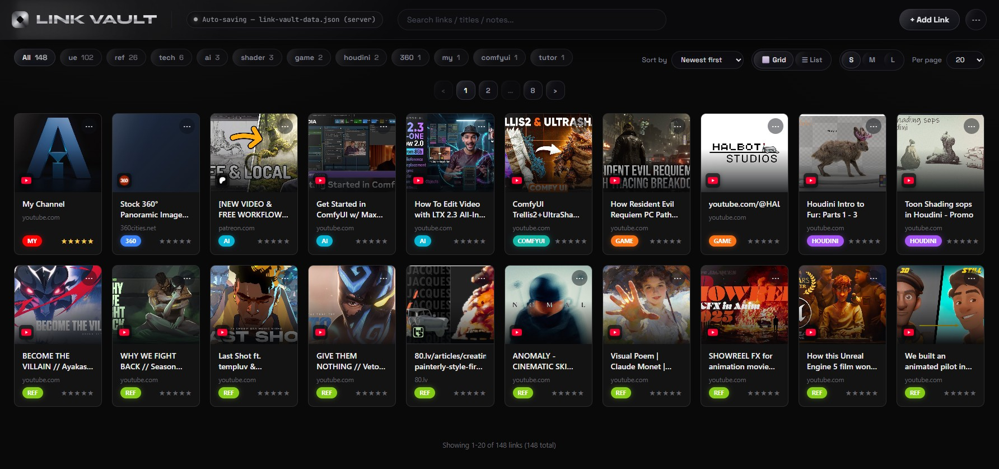
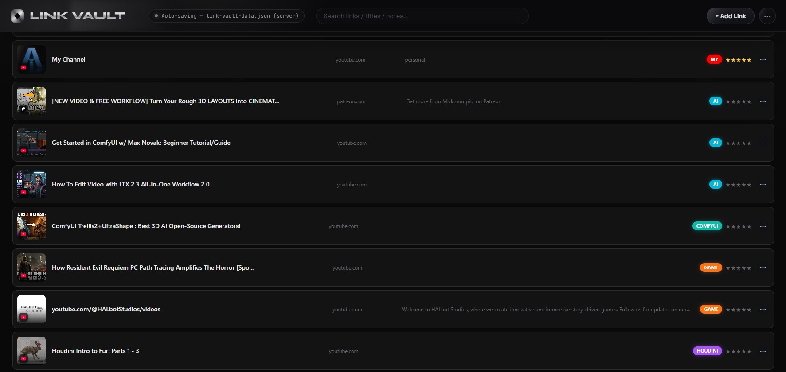

# Link Vault

A personal, self-hosted link/bookmark manager — browsable, taggable, and searchable,
with a clean grid of thumbnail cards.





## How to run it

Double-click **`webapp/Start Link Vault.vbs`**. That's it — no console window, no
install step beyond having Python on the machine. It starts a local server and opens
the app in your default browser.

- `webapp/stop.bat` — stops the background server when you're done.
- `webapp/start.bat` — same as the .vbs launcher but shows a console window (useful for
  seeing errors/logs if something looks broken).
- Opening `webapp/index.html` directly (double-click, no server) also works, but you
  lose the automatic zero-prompt save-to-file behavior — see **Data persistence**
  below.

Requires Python 3 to be installed (already the case on this machine). No other
dependencies — everything else is plain HTML/CSS/JS with zero build step.

## What it does

- Add / edit / delete links, each with: title, URL, category (with a custom
  user-assignable color), 1–5 star rating, and a free-text note.
- Grid view (thumbnail cards) or List view (compact rows) — toggle any time, remembers
  your choice.
- Card size toggle (S/M/L) and adjustable items-per-page (10/20/50/100/all), both
  remembered across sessions.
- Category filter chips (horizontally scrollable, won't blow up the toolbar height no
  matter how many categories you have) + sort by newest/rating/title.
- Search across title, URL, note, category, and source.
- Thumbnails: for YouTube video links, computed automatically from the video ID; for
  anything else, auto-fetched server-side (see below) by scraping the target page's
  `og:image` tag the first time you add it. When no thumbnail can be found at all, the
  card falls back to just the site's favicon shown as a small badge in the same
  bottom-left spot used on cards that do have a thumbnail (category background color
  is unaffected either way) — kept deliberately small/consistent rather than a big
  centered icon, so cards without thumbnails don't look out of place next to ones that
  have them.
- Export to JSON (manual backup) / Import from JSON (merges, skips URL duplicates).

## Data persistence — how your data is actually saved

This was iterated on a lot, so it's worth explaining clearly:

1. **Primary: `webapp/link-vault-data.json`.** When you run via the launcher above, a
   local Python server (`webapp/server.py`) serves the app *and* writes every
   add/edit/delete straight to this file automatically — no permission prompts, ever.
   This file **is** your database. Copy it (or the whole `webapp` folder) to another
   computer and everything comes with it, the same way a browser's bookmarks file
   works (i.e. it is *not* affected by clearing browser history/cache, because it's a
   real file on disk, not browser storage).
2. **Fallback: browser File System Access API.** If you open `index.html` without the
   server running, the app falls back to a "Connect Data File..." flow (via the "···"
   menu) that still writes to a real file you choose, but requires re-granting
   permission once per browser session (a browser security requirement, not something
   this app can avoid without the local server).
3. **Last-resort fallback: `localStorage`.** If neither of the above is connected, the
   app just uses browser storage so it still works, but this is the one mode that can
   be wiped by clearing browser data.
4. In all modes, `localStorage` is also kept as a fast local cache regardless — but
   whichever of #1/#2 is connected is the actual source of truth on load.

**Auto-fetching thumbnails for non-YouTube links** requires the local Python process to
reach the internet. If thumbnails aren't appearing for newly-added non-YouTube links,
check that `python.exe` isn't blocked by Windows Firewall (Settings → Privacy &
Security → Windows Security → Firewall & network protection → Allow an app; it needs
an **outbound** rule, not just inbound — inbound-only is a common half-fix).

## Design system ("Chrome Aurora")

The visual design (top bar wordmark/icon, pill-shaped controls, monochrome palette, the
subtle sweeping-light hover effect on buttons/thumbnails) follows a spec handed off in
`Link Vault Design/design_handoff_topbar/README.md`. Key tokens are also duplicated as
CSS custom properties at the top of `webapp/style.css` (the `--aurora-*` variables) so
all toolbar controls (chips, sort/size/page-size selects, view toggles, pagination)
stay visually consistent with the top bar. If asked to extend the design elsewhere,
reuse those tokens rather than introducing new colors.

## File structure

```
webapp/
  index.html              - markup
  style.css               - all styling incl. Chrome Aurora design tokens
  app.js                  - all app logic (single IIFE, no build step, no framework)
  seed-data.js            - initial seed data, used only on first-ever run
  server.py               - local server: static file serving + /api/data (save) +
                            /api/fetch-preview (server-side og:image scraping)
  link-vault-data.json    - the real database (created on first run)
  Start Link Vault.vbs    - recommended launcher, no console window
  start.bat / start_silent.bat / stop.bat  - alternate launch/stop scripts
```

## Known limitations

- The "Connect Data File" (File System Access API) fallback only works in
  Chromium-based browsers (Chrome, Edge) — not Firefox/Safari.
- Server-side thumbnail fetching depends on the local Python process having outbound
  internet access (see firewall note above).
- No multi-user/auth — this is a single-user local tool by design.
